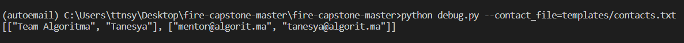
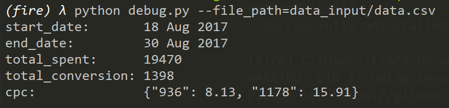
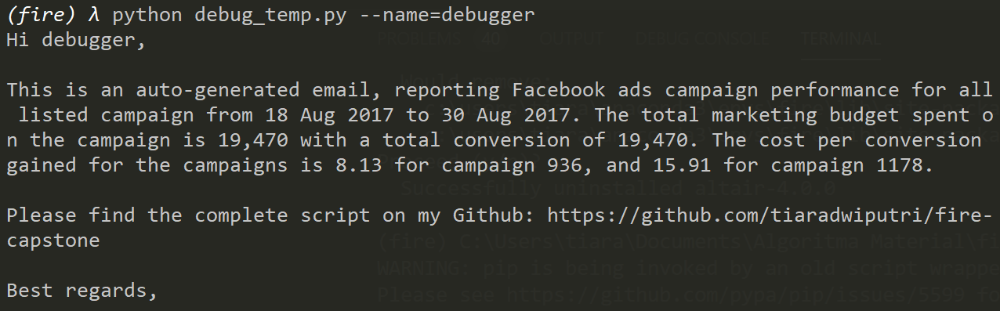
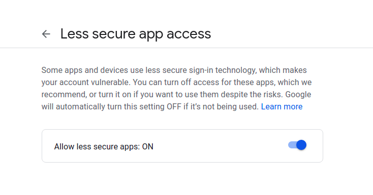

# Auto Generated Email Based Report

This is developed as one of Algoritma Academy Data Analytics Specialization using capstone Projects. The deliverables of this project is a python script to send an automated generated email using SMTP using Outlook email host. We will also utilize Google's `fire` package for easy interfacing with bash command. 

## Rubric

The maximum score you will obtain from this project is 16 points:  

- Environment preparation (*2pts*)  
- Understanding the contact list creation (*2pts*)  
- Compose email: create templates, compose messages, extract summary (*6pts*)  
- Export a plot using matplotlib (*6pts*)

## Setup

### Requirements

There are few prerequisites needed for this project, first you will need to prepare a new conda environment installed with all package dependencies. Please follow through the following command to create a new conda environment and install the dependencies:

1. Create new conda environment under python 3.7:

```
conda create -n <env_name> python=3.7
conda activate <env_name>
```

2. Since it is beneficial for us to create a draft using Jupyter Notebook, let's also create an iPython Kernel using the following command:

```
pip install ipykernel
python -m ipykernel install --user --name=<env_name>
```

3. Direct your Terminal / Anaconda Prompt to the directory of the downloaded repository:

```
cd <path_to_folder>
```

Example:
- `cd "C:\\Users\Desktop\Algoritma Academy\fire-capstone-master"`

4. Install the requirements:

```
pip install -r requirements.txt
```

### Environment Variable

Since the program will later need to access your personal email and password, to avoid the password being hardcoded to the program, you are required to create two environment variables:

- `EMAIL_ADDRESS`: stores the email address you'll use as the sender
- `EMAIL_PASSWORD`: stores the email password

#### Windows

To save passwords and secret keys in environment variables on Windows, you will need to open `Advance System Setting`:

1. In your Windows taskbar, search for `Edit the system environment variables.`
2. Now in `Advance System Setting` click on `Environment Variables`.
3. Add new user variables by clicking `New` under `User Variables`.
4. In the new window you can add Variable name and Variable value. Add two new variables; `EMAIL_ADDRESS` and store the address as the value and `EMAIL_PASSWORD` for the password and click ok.
5. Now, click `Ok` on Environment Variables window to save changes.

To check if your variables have stored correctly, run `echo %EMAIL_ADDRESS%` and `echo %EMAIL_PASSWORD%` in your Command Prompt. They should return your email address and password respectively 

#### Mac & Linux

1. Open up your Terminal and run `nano ~/.bashrc`
2. Scroll to the bottom of the file and add:
```
export EMAIL_ADDRESS=<your_email>
export EMAIL_PASSWORD=<your_password>
```
Note: There should not be any whitespace on either side of `=` sign. Example:
```
export EMAIL_ADDRESS=algoritma123@outlook.com
export EMAIL_PASSWORD=algorima123
```
3. Save the nano file by pressing `ctrl + x` and `Y`. Then, run `source ~/.bashrc` to effect the changes.

To check if your variables have stored correctly, run `echo $EMAIL_ADDRESS` and `echo $EMAIL_PASSWORD` in your Terminal. They should return your email address and password respectively 

## The Challenge

In this capstone project, you will try to complete 4 challenges:

1. Extract data frame information to compose an email
2. Export a plot using matplotlib to be attached to the email
3. Testing application modularity using `fire`
4. Login to your Outlook (recommended) or Gmail email using Python's SMTP library

Finally, you will need to complete the final mission by sending us an auto generated email to a specified email.

### Challenge 1 & 2: Extract Summary & Create Plot

In this section you will need to extract all the variables listed in the second point from the templates object: `START_DATE`, `END_DATE`, `TOTAL_SPENT`, `TOTAL_CONVERSION`, and `CPC`. This process is completed under `extract_summary` function. The data we'll be using is stored under `data_input` folder named `data.csv`. It was downloaded from [Kaggle dataset repository](https://www.kaggle.com/madislemsalu/facebook-ad-campaign) provided by [Madis_Lemsalu](https://www.kaggle.com/madislemsalu). The data contains daily ads report run on Facebook, showing different marketing campaign from 18th to 30th of August 2017. Please refer to the following glossary of the variables:

- `ad_id`: Unique identifier of the daily ads
- `reporting_start`: The start date of the generated report. Since it is a daily report, this variable and `reporting_end` will have the same value
- `reporting_end`: The end date of the generated report. Since it is a daily report, this variable and `reporting_start` will have the same value
- `campaign_id`: unique identifier of a campaign, one campaign could have several creative ads
- `fb_campaign_id`: Facebook's identifier of each running ads
- `age`: The age group on which the ad is promoted
- `gender`: The gender on which the ad is promoted
- `interest1`, `interest2`, and `interest3`: The interest group id on which the ad is promoted
- `impressions`: Number of people viewing the ad
- `clicks`: Number of people clicking the ad
- `spent`: Amount of marketing cost spent
- `total_conversion`: Number of conversions (commonly a buying action) happened
- `approved_conversion`: Number of approved conversions after cross checked with the actual business. In some cases, a conversion tracked by the ad doesn't really record with a complete buying action from the customers.

For this step, you might want to use Jupyter Notebook to perform a more complex data wrangling process. I have prepared `helper.ipynb` to help you get the summary needed for the email. 

Once you're done with the wrangling process, you will be able to complete both `extract_summary` and `create_plot` module on `send_email.py` and move forward to the next challenge.

### Challenge 3: Application Modularity

[Python Fire](https://github.com/google/python-fire) is a library for automatically generating command line interfaces (CLIs) from absolutely any Python object. We will use `fire` to helps us run our `send_email.py` on a modular basis to helps us debug the remaining skeleton.

#### 3.1. Your first `debug.py`: Modify the contacts

This module is designed to support email blast to multiple recipients at a time. The contacts list is stored on external file under `templates/contacts.txt`. Each line will represent 1 contact list with the following format:

`person name email`

The string stated in before email string will be used to address the person in the email. For example the following contact list:

`Team Algoritma mentor@algorit.ma`

will be separated into two variables:
- Name: Team Algoritma
- Email: mentor@algorit.ma

1. The code that support this is stored under `extract_contacts` function defined in the script. Let's use `fire` to  create a simple debugging script. Take a look at the following script, you can copy and paste it and save it under `debug.py`:

```py
from send_email import extract_contacts
import fire

if __name__ == '__main__':
  # Export to Fire
  fire.Fire(extract_contacts)
```

2. This chunk of code is simply exporting `extract_contacts` function accessible in our CLI. Then, you should be able to perform the following command in a CLI: `python debug.py --contact_file=templates/contacts.txt`

3. If you have set the function properly, it should extracted 2 elements list, one containing all names and one containing all emails. Try to edit the `contacts.txt` stored within templates folder, and change the list into mentor@algorit.ma and your own email. See if it produce a similar output with the following example:



#### 3.2. Run `extract_summary` separately

Now, let's try to check whether you have completed Challenge 1 properly by running the `extract_summary` function in your CLI. Try to modify the `debug.py` you created on the previous section to make sure it is returning a dictionary like expected:



*Extra Tip*:

- You only need to change which module you import and export it to `Fire`

#### 3.2. Compose the email

If the `extract_summary` can run properly, you will now be able to compose the email. Try to use the `debug_temp.py` script I have included in the repository and run it in your CLI with: `python debug_temp.py --name=debugger`

It should return `NameError: name '___' is not defined`, since you have not complete the `compose_email` function in `send_email.py`. Try to complete the function, then it should be able to print out the template's variables filled in with the extracted information from the previous steps: 



*Extra Tips*:

- Fill up `START_DATE`,`END_DATE`,`TOTAL_SPENT`,`TOTAL_CONVERSION` on `compose_email` function
- Change the `GITHUB_LINK` variable to your own repository!

### Challenge 4: Setting up your email with Python SMTP

The SMTP setup is managed within `authenticate_account` function. The default email host used is an **Outlook server** (If you want to use Gmail as the sender address, please read the additional section below). 
The `smtplib` library will manage SSL authetication for your email address. For security purposes, you will need to set up an environment variables on your local machine called `EMAIL_ADDRESS` and `EMAIL_PASSWORD` (See Setup: Environment Variable section). This is done to avoid having to hard code your email and password on the script and risking it to be accidentaly shared accross the internet.

To verify your environment variables, run the following python code and see if the proper value is printed out:

```
import os
print(os.environ['EMAIL_ADDRESS'])
print(os.environ['EMAIL_PASSWORD'])
```

If each line successfuly printed out on the respective environment, you should be good to go.

#### Additional setup for Gmail user

1. **Modify the `send_email.py`**: Please change the `host` and `SERVER` on `authenticate_account` as below:

```py
def authenticate_account(EMAIL, PASSWORD, SERVER='gmail'):
  """   
  Authenticate SMTP account for gmail
  Other host is not supported
  """

  if(SERVER == 'gmail'):
    host = 'smtp.gmail.com'
    port = 587
  else:
    raise("Email host is not supported")

  s = smtplib.SMTP(host=host, port=port)
  s.starttls()
  s.login(EMAIL, PASSWORD)

  return s
```

2. **Allow less secure apps access**: By default, Gmail prevent third party credentials by set the less secure apps to OFF. You will need to turn it ON by accessing this [link](https://myaccount.google.com/u/5/lesssecureapps?rapt=AEjHL4PQ6yQ70VpdoYkte6rjyBKjg7mYhMMLAVMeg78qjZFhtwDODuX9xatbV4jzgI1CNZhevZ1Ivw5zT8cY0ClhBkl0Wocasw) and make sure the setting is turned ON:



**Note**:

- This setting may not be available for accounts with 2-Step Verification enabled.


## Final Mission

The `fire` package has been set up to fire `main` function when called. If the script has been set up properly, you should be able to call the function from CLI. The parameter passed into the function can be specify using the syntax: `--param=value`. You can pass in multiple parameters within one line execution, the available parameters are:

- `subject`: Provide your email subject
- `contact_file`: If you have been paying attention, you will need to change the default value of this parameter
- `template_file`: Default set to `templates/body.txt`
- `data_file`: Default set to `data_input/data.csv`

The bash command should be able to fire the script using the following syntax:

```
python send_email.py --subject="YOUR SUBJECT"
```

If all components has been properly set up, you should be able to sent us an auto generated report email to `mentor@algorit.ma`. Your final mission in this capstone project is to send us an email, providing your GitHub link on the email with the exported plot attached. Please send the email with the following details:

Subject: 
>[BATCH_NAME DA CAPSTONE] Facebook Email Report

For example:

>[IRIS DA CAPSTONE] Facebook Email Report

Body Template:

> Hi Team Algoritma,
>
> This is an auto-generated email, reporting Facebook ads campaign performance for all listed campaign from \${START_DATE} to \${END_DATE}. The total marketing budget spent on the campaign is \${TOTAL_SPENT} with a total conversion of \${TOTAL_CONVERSION}. The cost per conversion gained for the campaigns is \${CPC}.
>
>Please find the complete script on my Github: ${GITHUB_LINK}
>Best regards,


We are looking forward for your email!

---
Good luck and happy coding!
